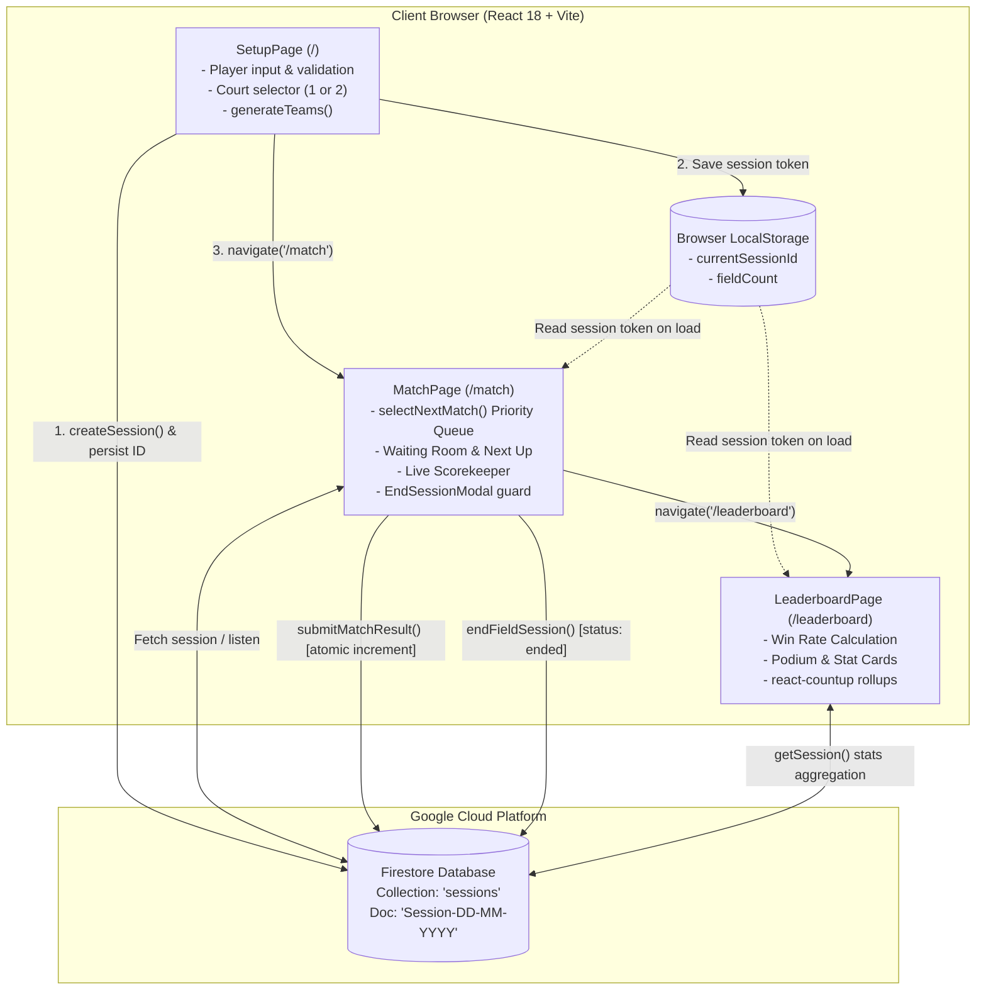

# 🏸 BukkuTangkis — Project Overview

> **BukkuTangkis** is a modern, high-performance badminton matchmaking and court session manager. Built with **React 18**, **Vite 5**, **Tailwind CSS 3**, and **Google Firebase Firestore**, it is designed to eliminate the chaos of managing community badminton nights, social sparring, and friendly tournaments.

---

## 📌 Executive Summary

Organizing badminton sessions with rotating doubles pairs often leads to player dissatisfaction: some players get stuck on the bench for consecutive matches, court utilization remains uneven, and score tracking with pen-and-paper or spreadsheet apps is error-prone and distracting.

BukkuTangkis solves these pain points through:
1. **Automated Team Generation**: Randomly pairing players into balanced 2-player teams via the [[02-Matchmaking-Logic#1. Team Generation (`generateTeams`)|Fisher-Yates shuffle algorithm]].
2. **Fair Rotation Matchmaking**: A mathematical priority queue based on `(matchesPlayed ASC, lastPlayedOrder ASC)` that guarantees zero player starvation and equal court time.
3. **Dedicated Waiting Room**: Intelligent handling for odd team counts where the sitting team is prominently queued as **"Next Up"** and guaranteed to play the very next match.
4. **Multi-Court Scalability**: Support for 1 or 2 courts simultaneously with synchronized session state.
5. **Real-Time Cloud Persistence**: Backed by **Firebase Firestore** with lightweight atomic increment writes for frictionless performance.
6. **Polished Dark Glassmorphism UX**: Styled with custom backdrop blurs, floating ambient gradients, Framer Motion transitions, and animated statistics.

---

## 🛠️ Technology Stack

| Category | Technology | Version | Purpose & Architecture Role |
| :--- | :--- | :--- | :--- |
| **Frontend Framework** | **React** | `^18.3.1` | Component-based UI with hooks (`useState`, `useEffect`, `useMemo`) |
| **Build Tool & Bundler** | **Vite** | `^5.4.0` | Ultra-fast Hot Module Replacement (HMR) and optimized ESM build |
| **Routing** | **React Router DOM** | `^6.26.0` | Client-side routing between setup, match court, and leaderboard |
| **Styling & Design System** | **Tailwind CSS** | `^3.4.13` | Utility-first CSS extended with custom glassmorphism styles and dark palette |
| **Animation Engine** | **Framer Motion** | `^11.5.0` | Route transition orchestrations (`AnimatePresence`) and interactive cards |
| **Iconography** | **Lucide React** | `^0.447.0` | Clean, modern feather-style SVG iconography |
| **Backend & Database** | **Firebase (Firestore)**| `^10.14.0` | NoSQL document database for live session storage and player statistics |
| **Data Visualization** | **react-countup** | `^6.5.3` | Smooth roll-up number animations for the leaderboard podium |

> [!NOTE]
> All UI components follow an ultramodern **Dark Neon & Glassmorphism** design language (`bg-dark-900`, `backdrop-blur-xl`, `border-white/10`) to provide high contrast in brightly lit sports halls and badminton centers.

---

## 🌟 Core Features & Modules

### 1. Session Setup & Player Registration (`/`)
- **Automated Session ID**: Automatically derives unique daily session IDs in the format `Session-DD-MM-YYYY` (e.g., `Session-30-09-2026`).
- **Flexible Court Count**: Single-court (minimum 4 players) or dual-court (minimum 8 players) setup.
- **Robust Client Validation**: Prevents duplicate player names, empty fields, and enforces even player counts for 2v2 doubles teams.
- **Instant Team Scrambling**: Shuffles registered participants into randomized doubles pairs.

### 2. Live Match Dashboard (`/match`)
- **Fair Priority Queue**: Always places the teams with the fewest matches and oldest play timestamps onto active courts.
- **Odd-Team Waiting Room**: Teams currently sitting out are visually positioned in the *Next Up* deck so players know exactly when they are playing.
- **Unconstrained Score Input**: No arbitrary score ceilings (supports standard 21-point, 30-point, or deuce rallies).
- **Atomic Cloud Logging**: Match results increment `total_matches` for all 4 players and `total_wins` for the 2 winners in Firestore via `increment(1)`.

### 3. Session Safeguards & Modal Validation
- **In-Progress Protection**: If a tournament host attempts to finish a session while a game is ongoing, an [[01-System-Architecture#1. Component Hierarchy & Tree|EndSessionModal]] pops up.
- **Host Choice**: Allows the host to either **"Wait"** for the match to complete naturally or **"Cancel Match & End"**.

### 4. Interactive Leaderboard (`/leaderboard`)
- **Auto-Calculated Standings**: Ranks all session players by **Win Rate (%)**, **Total Wins**, and **Total Matches Played**.
- **Dynamic Podium Highlights**: Visual badges and glowing accents for 1st, 2nd, and 3rd place finishes.
- **Count-Up Stat Displays**: Uses `react-countup` to animate metrics as the leaderboard loads.

---

## 📐 System Architecture & Flow

The following diagram illustrates how user interactions flow across application routes and how data synchronizes between React local state, browser storage, and Firebase Firestore:

---

## 📚 Documentation Index

To explore the inner workings of BukkuTangkis, refer to the detailed documentation files:

- 🏗️ **[[01-System-Architecture]]** — Component hierarchy, Firestore schema, routing rules, and dual-layer state management.
- 🧮 **[[02-Matchmaking-Logic]]** — In-depth breakdown of the priority queue algorithm, Fisher-Yates pairing, odd-team handling, and mathematical proofs of fair rotation.
- 📜 **[[03-Changelog]]** — Development milestones, implementation phases (Phase 1 through Phase 6), and version history.
- 🔥 **[[04-Firebase-Setup-Guide]]** — Step-by-step guide to provisioning Firebase Firestore, security rules, and production deployment.

---

> [!TIP]
> Use the Obsidian Graph View (`Ctrl + G`) to inspect connections between documentation nodes and understand how code components correlate with business requirements.
