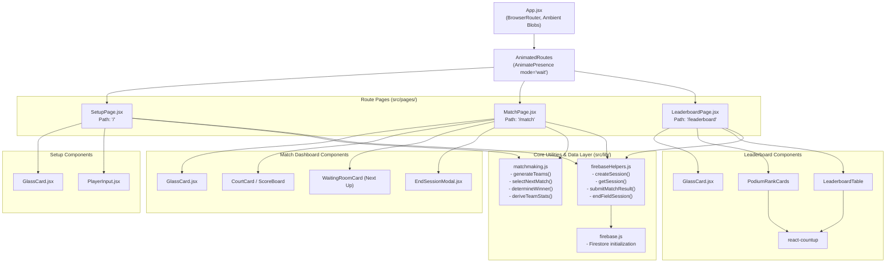
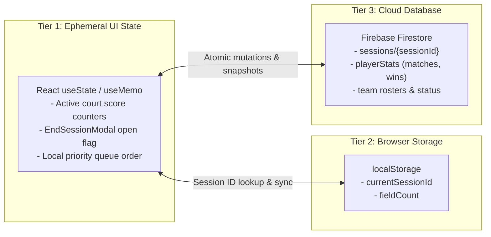

# 🏗️ BukkuTangkis — System Architecture

This document provides a comprehensive structural overview of the BukkuTangkis web application, detailing the component tree, Firebase Firestore schema, client-side routing, and hybrid state management strategy.

---

## 1. Component Hierarchy & Tree

BukkuTangkis is constructed with a modular, atomic React component architecture wrapped in an animated, glassmorphic dark container.



### Component Roles & Responsibilities

| Component | File Path | Primary Responsibility |
| :--- | :--- | :--- |
| `App` | `src/App.jsx` | Mounts `BrowserRouter`, manages global dark layout and floating ambient glow blobs. |
| `AnimatedRoutes` | `src/App.jsx` | Hosts `AnimatePresence` to enable smooth cross-fade route transitions on navigation. |
| `SetupPage` | `src/pages/SetupPage.jsx` | Generates session ID, captures player list, enforces 2v2 validation, creates Firestore document. |
| `MatchPage` | `src/pages/MatchPage.jsx` | Operates the live priority queue match loop, score counters, waiting room, and modal controls. |
| `LeaderboardPage` | `src/pages/LeaderboardPage.jsx` | Calculates win rate % from Firestore `playerStats`, renders podium medals, and animates figures. |
| `GlassCard` | `src/components/GlassCard.jsx` | Unified container featuring backdrop-blur (16px/24px), translucent borders, and entry transitions. |
| `PlayerInput` | `src/components/PlayerInput.jsx` | Numbered row for participant registration with real-time removal button. |
| `EndSessionModal` | `src/components/EndSessionModal.jsx` | Warning modal triggered when clicking "End Session" during an unfinished match. |

---

## 2. Firebase Firestore Data Model

BukkuTangkis adopts a **denormalized document model** optimized for low-latency queries and atomic increment updates. All session data lives under the `sessions` top-level collection.

### Document Path
```text
sessions/{sessionId}
Example: sessions/Session-30-09-2026
```

### Document Schema (TypeScript Interface)

```typescript
interface PlayerStatistic {
  total_matches: number; // Total games participated in
  total_wins: number;    // Total games won
}

interface FieldData {
  status: 'active' | 'ended';
  players: string[];     // Array of participant names (e.g., ["Alex", "Budi", ...])
  teams: [string, string][]; // Fixed 2-player pairs formed at setup
  playerStats: {
    [playerName: string]: PlayerStatistic;
  };
}

interface SessionDocument {
  createdAt: string;     // ISO 8601 timestamp (e.g. "2026-09-30T06:39:30.000Z")
  fieldCount: 1 | 2;     // Number of operational courts
  status: 'active' | 'ended';
  field1: FieldData;
  field2?: FieldData;    // Present only if fieldCount === 2
}
```

### Sample Firestore Document Instance (JSON)

```json
{
  "createdAt": "2026-09-30T06:39:30.000Z",
  "fieldCount": 1,
  "status": "active",
  "field1": {
    "status": "active",
    "players": ["Kevin", "Marcus", "Hendra", "Ahsan", "Fajar", "Rian"],
    "teams": [
      ["Kevin", "Marcus"],
      ["Hendra", "Ahsan"],
      ["Fajar", "Rian"]
    ],
    "playerStats": {
      "Kevin":  { "total_matches": 2, "total_wins": 2 },
      "Marcus": { "total_matches": 2, "total_wins": 2 },
      "Hendra": { "total_matches": 2, "total_wins": 0 },
      "Ahsan":  { "total_matches": 2, "total_wins": 0 },
      "Fajar":  { "total_matches": 2, "total_wins": 1 },
      "Rian":   { "total_matches": 2, "total_wins": 1 }
    }
  }
}
```

### Atomic Updates via Field Increment

To maintain high data integrity and avoid write collisions when scores are submitted, BukkuTangkis relies on Firestore's native `increment(1)`:

```javascript
// From src/lib/firebaseHelpers.js: submitMatchResult()
const updates = {}

// +1 total_matches for all 4 players
allPlayers.forEach((player) => {
  updates[`${fieldKey}.playerStats.${player}.total_matches`] = increment(1)
})

// +1 total_wins for the 2 winners only
winnerPlayers.forEach((player) => {
  updates[`${fieldKey}.playerStats.${player}.total_wins`] = increment(1)
})

await updateDoc(sessionRef, updates)
```

> [!NOTE]
> **Ephemeral Score Philosophy**: BukkuTangkis intentionally does **not** persist point-by-point rally scores into Firestore. Raw scores are used strictly in client memory to evaluate the winner (`Math.max(scoreA, scoreB)`). Only `total_matches` and `total_wins` are committed to the cloud. This reduces write bandwidth by over 80% and ensures zero latency overhead on mobile networks.

---

## 3. Client Routing Architecture

BukkuTangkis utilizes `react-router-dom` (v6) with path-based route declarations.

| Route | Page Component | Access Requirement | Purpose |
| :--- | :--- | :--- | :--- |
| `/` | `SetupPage` | Public / Entry Point | Session configuration, player registration, team assignment. |
| `/match` | `MatchPage` | Requires `currentSessionId` | Live match queue, court display, score logging, session termination. |
| `/leaderboard` | `LeaderboardPage` | Requires `currentSessionId` | Final session standings, podium medals, win rates, summary stats. |

### Route Transitions with Framer Motion

```jsx
// src/App.jsx
<AnimatePresence mode="wait">
  <Routes location={location} key={location.pathname}>
    <Route path="/" element={<SetupPage />} />
    <Route path="/match" element={<MatchPage />} />
    <Route path="/leaderboard" element={<LeaderboardPage />} />
  </Routes>
</AnimatePresence>
```
- `mode="wait"` guarantees the outgoing page completes its exit fade (`opacity: 0, y: -10`) before the incoming page begins its entrance animation (`opacity: 0, y: 20` $\rightarrow$ `opacity: 1, y: 0`).

---

## 4. State Management Approach

BukkuTangkis avoids heavy external state libraries (such as Redux) in favor of a clean, reliable **Three-Tier Hybrid State Model**:



### 1. In-Memory React State (Tier 1)
- **Live Match Scores**: Score input values for Team A and Team B are managed via React local state.
- **Queue Pointer**: Priority queue order and round counter for the active session.
- **Safety Modal State**: Boolean flag `isModalOpen` governing the [[#Component Hierarchy & Tree|EndSessionModal]].

### 2. Local Browser Storage (Tier 2)
- Upon starting a session, the following keys are written to `localStorage`:
  ```javascript
  localStorage.setItem('currentSessionId', sessionId)
  localStorage.setItem('fieldCount', String(fieldCount))
  ```
- **Page Refresh Protection**: If a user reloads during `/match` or `/leaderboard`, the app extracts `currentSessionId` from `localStorage` and rehydrates the screen without loss of context. If no session key exists, the user is redirected gracefully to `/`.

### 3. Remote Cloud State (Tier 3)
- Authoritative session stats are fetched via `getSession(sessionId)`.
- Updates are dispatched via `submitMatchResult()` and `endFieldSession()`.

### Hydration & Queue Reconstruction (`deriveTeamStats`)
When a user refreshes the page during an active match session, the priority queue state in RAM is restored using `deriveTeamStats`:

```javascript
// src/lib/matchmaking.js
export function deriveTeamStats(teams, playerStats = {}) {
  const stats = {}
  teams.forEach((team, idx) => {
    const p = playerStats[team[0]] || { total_matches: 0 }
    stats[idx] = {
      matchesPlayed: p.total_matches,
      lastPlayedOrder: p.total_matches, // Reconstructs queue position
    }
  })
  return stats
}
```

---

## 🔗 Related Documentation

- 🏸 **[[00-Project-Overview]]** — High-level feature roadmap and tech stack specification.
- 🧮 **[[02-Matchmaking-Logic]]** — In-depth breakdown of the priority queue algorithm and rotation fairness.
- 📜 **[[03-Changelog]]** — Development log and phase-by-phase implementation notes.
- 🔥 **[[04-Firebase-Setup-Guide]]** — Configuration guide for Firestore and deployment instructions.
