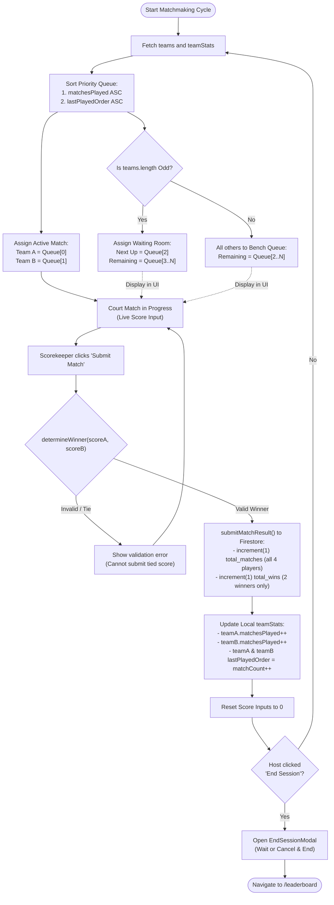

# 🧮 BukkuTangkis — Matchmaking Logic & Algorithm

This document provides an exhaustive mathematical and algorithmic breakdown of the **Fair Rotation Matchmaking Engine** in BukkuTangkis (`src/lib/matchmaking.js`).

---

## 🎯 Core Objectives & Fairness Guarantee

In community badminton sessions, casual matchmaking often suffers from two chronic issues:
1. **Player Starvation**: Aggressive or vocal players dominate the court while shy or tired players sit on the sidelines for multiple games in a row.
2. **Unequal Play Time**: Without strict bookkeeping, some teams end up playing 6 matches while others only play 2 or 3.

BukkuTangkis eliminates these issues through an automated **Priority Queue Fair Rotation Engine**:
- **Guarantee 1 (Equal Matches)**: No team will ever lead another team by more than 1 match played throughout the session.
- **Guarantee 2 (No Back-to-Back Sits)**: With an odd number of teams, no team will ever sit out two consecutive matches.
- **Guarantee 3 (Fatigue Protection)**: Teams that just finished a match are immediately demoted to the back of the queue.

---

## 1. Team Generation (`generateTeams`)

At the start of each session on the [[01-System-Architecture#Component Roles & Responsibilities|SetupPage]], participants are randomized and paired into fixed 2-player doubles teams.

### Fisher-Yates (Knuth) Shuffle
BukkuTangkis uses an unbiased $O(N)$ Fisher-Yates shuffle to ensure completely uniform team distribution:

```javascript
// src/lib/matchmaking.js
function shuffle(array) {
  const arr = [...array]
  for (let i = arr.length - 1; i > 0; i--) {
    const j = Math.floor(Math.random() * (i + 1))
    ;[arr[i], arr[j]] = [arr[j], arr[i]]
  }
  return arr
}

export function generateTeams(players) {
  const shuffled = shuffle(players)
  const teams = []
  for (let i = 0; i < shuffled.length; i += 2) {
    teams.push([shuffled[i], shuffled[i + 1]])
  }
  return teams
}
```

### Constraints & Invariants
- **Even Player Count**: The player count $N$ must satisfy $N \ge 4$ and $N \pmod 2 = 0$.
- **Dual-Court Splitting**: When 2 courts are enabled ($N \ge 8$), players are partitioned into two balanced halves before calling `generateTeams()`, ensuring both courts have even player allocations:
  ```javascript
  const half = Math.floor(valid.length / 2)
  const adjusted = half % 2 !== 0 ? half + 1 : half
  const f1 = valid.slice(0, adjusted)
  const f2 = valid.slice(adjusted)
  ```

---

## 2. Fair Rotation Priority Queue (`selectNextMatch`)

The core matchmaking logic uses a **two-tier priority queue** sorting algorithm.

### Function Signature
```javascript
export function selectNextMatch(teams, teamStats = {})
```

### Priority Sort Comparator
Each team is indexed and mapped with their historical metrics:
- `matchesPlayed`: Total games completed by this team in the current session.
- `lastPlayedOrder`: The incremental order index when the team last completed a game (0 if never played).

```javascript
indexed.sort((a, b) => {
  // Tier 1: Prioritize teams with the fewest matches played
  if (a.matchesPlayed !== b.matchesPlayed)
    return a.matchesPlayed - b.matchesPlayed

  // Tier 2: Tie-breaker — prioritize teams who played least recently
  return a.lastPlayedOrder - b.lastPlayedOrder
})
```

### Selection Rules
1. **Court Assignment**:
   - `teamA` = `indexed[0]` (Highest priority team)
   - `teamB` = `indexed[1]` (Second highest priority team)
2. **Post-Match Demotion**:
   - When the match concludes, `teamA` and `teamB` have their `matchesPlayed` incremented by `+1`.
   - Their `lastPlayedOrder` is updated to the latest sequence counter (`matchCount++`).
   - Consequently, in the next sorting cycle, they automatically drop to the **very back of the queue**.

---

## 3. Odd-Team Handling & "Waiting Room - Next Up"

When the total number of teams on a court is **odd** (e.g., 3 teams = 6 players, 5 teams = 10 players), 1 team must rest while the other 2 play.

### The Problem in Traditional Rotations
In manual rotations, the bench team is frequently forgotten, leading to situations where a team rests for 2 or 3 matches while others continue playing.

### The BukkuTangkis Solution
In `selectNextMatch()`, the team positioned at index `[2]` in the sorted queue is officially designated as the **Waiting Room Team** (`waitingTeam`):

```javascript
const remaining = indexed.slice(2)
const isOdd = teams.length % 2 !== 0

const waitingTeam =
  isOdd && remaining.length > 0
    ? { index: remaining[0].index, players: remaining[0].players }
    : null

const queue = (isOdd ? remaining.slice(1) : remaining).map((t) => ({
  index: t.index,
  players: t.players,
}))
```

### Mathematical Proof of Immediate Next Play
Let there be 3 teams: $T_0, T_1, T_2$.
- **Round 1**:
  - Initial stats: all have `matchesPlayed = 0`, `lastPlayedOrder = 0`.
  - Selection: $T_0$ vs $T_1$ are on Court.
  - Waiting Team: $T_2$ (`matchesPlayed = 0`).
  - Result: $T_0$ and $T_1$ finish match.
  - Updated stats:
    - $T_0$: `matchesPlayed = 1, lastPlayedOrder = 1`
    - $T_1$: `matchesPlayed = 1, lastPlayedOrder = 1`
    - $T_2$: `matchesPlayed = 0, lastPlayedOrder = 0`
- **Round 2 Selection**:
  - The queue sorts by `matchesPlayed ASC`.
  - $T_2$ has `0` matches played, while $T_0$ and $T_1$ have `1`.
  - Therefore, **$T_2$ is mathematically guaranteed to be index `[0]` in Round 2!**
  - Between $T_0$ and $T_1$, one will play and the other will become the new `waitingTeam`.

> [!IMPORTANT]
> **Anti-Starvation Guarantee**: Under this algorithm, no team will ever wait for more than **1 match** before returning to the court.

---

## 4. Match Scoring & Winner Evaluation (`determineWinner`)

BukkuTangkis does not enforce arbitrary score limits (such as forcing exactly 21 or 30 points). The winner is evaluated using raw arithmetic comparison:

```javascript
// src/lib/matchmaking.js
export function determineWinner(scoreA, scoreB) {
  const a = Number(scoreA)
  const b = Number(scoreB)
  if (Number.isNaN(a) || Number.isNaN(b) || a === b) return null
  return a > b ? 'teamA' : 'teamB'
}
```

### Why No Hardcoded Limits?
- Supports official BWF regulations (21 points, deuce up to 30).
- Supports recreational rubber-set caps (e.g., first to 15 or 30 points).
- Supports handicap scoring for mixed-skill sessions.
- Automatically rejects ties (`a === b`) and invalid inputs (`NaN`), prompting the scorekeeper to resolve the score before advancing.

---

## 5. Queue Reconstruction on Refresh (`deriveTeamStats`)

If a browser tab is accidentally reloaded or closed, local queue state is reconstructed from Firestore `playerStats`:

```javascript
// src/lib/matchmaking.js
export function deriveTeamStats(teams, playerStats = {}) {
  const stats = {}
  teams.forEach((team, idx) => {
    // Player 1's stats mirror the team's historical games
    const p = playerStats[team[0]] || { total_matches: 0 }
    stats[idx] = {
      matchesPlayed: p.total_matches,
      lastPlayedOrder: p.total_matches, // Best approximation after reload
    }
  })
  return stats
}
```

This guarantees seamless session continuity without resetting match counts.

---

## 🔄 Match Lifecycle Flowchart

The following diagram tracks the complete lifecycle of a single match within BukkuTangkis:



---

## 🔗 Related Documentation

- 🏸 **[[00-Project-Overview]]** — Overall application architecture and feature scope.
- 🏗️ **[[01-System-Architecture]]** — Firestore schema, state management, and component hierarchy.
- 📜 **[[03-Changelog]]** — Development history and feature milestones.
- 🔥 **[[04-Firebase-Setup-Guide]]** — Firestore setup and hosting configuration.
